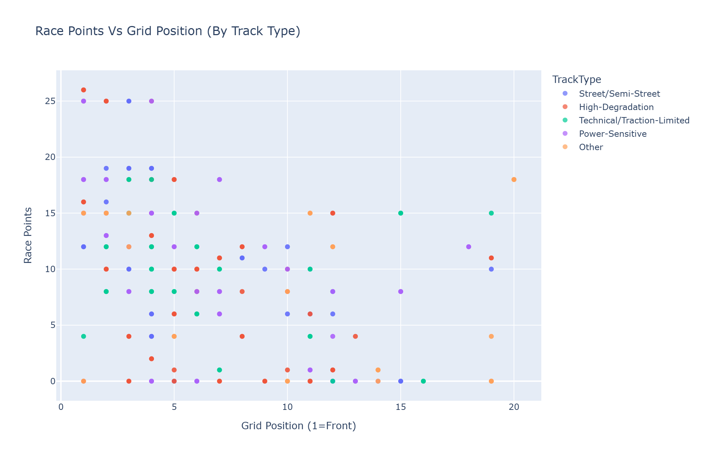
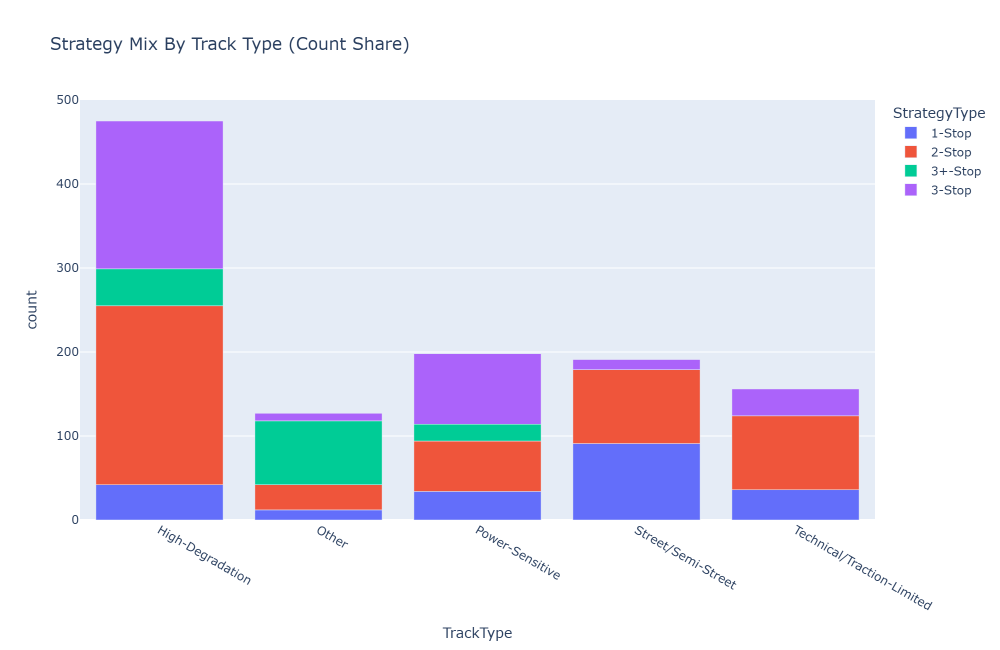
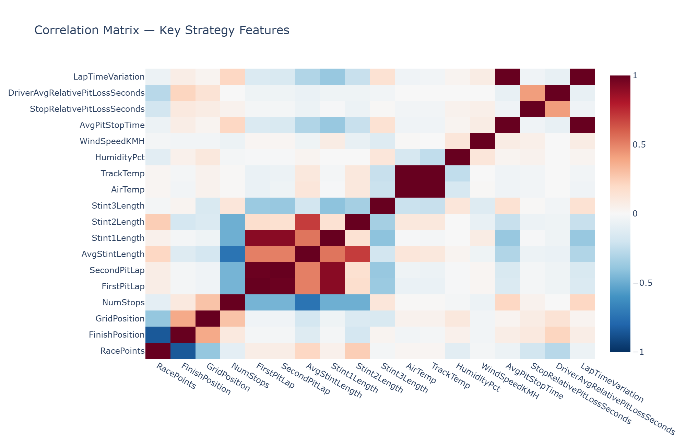
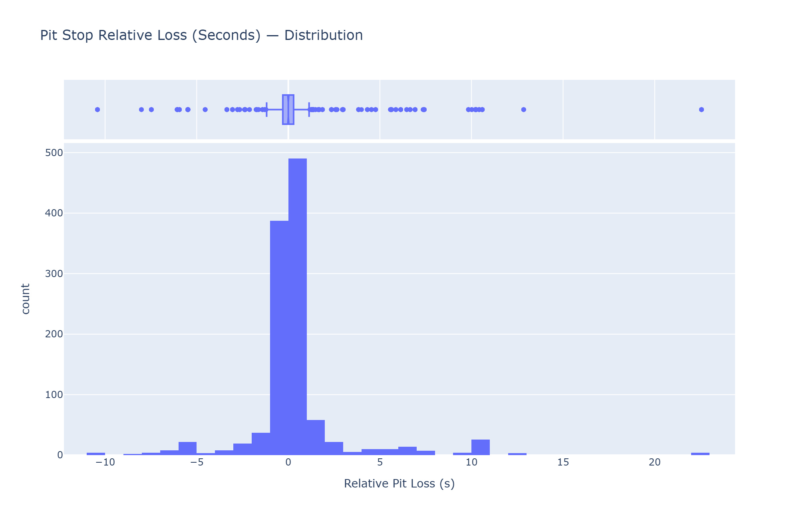

# F1 Pit Stop Strategy Optimization (2018-2024)

An end-to-end data analytics project that uses **descriptive**, **predictive**, and **prescriptive** methods to optimize Ferrari's Formula 1 race strategy across 7 seasons of real-world data.

## Problem Statement

Pit stop strategy is one of the few controllable levers in an F1 race. This project investigates how tire compound selection, pit timing, number of stops, and environmental conditions impact Ferrari's race results. It uses these findings builds models to recommend optimal strategies per track type.

## Dataset

- **1,182 race-stop observations** across **126 unique race weekends** (2018-2024)
- **63 engineered features** covering race outcome, pit strategy, tire compounds, stint lengths, weather telemetry, and driver metrics
- Built by merging two source datasets:
  - [F1 Championship Data (1950-2024)](F1-Championship-Data.zip) - results, circuits, pit stops, standings
  - [F1 Pitstop Data (2018-2024)](F1-Pitstop-Data.zip) - enriched telemetry: air/track temp, humidity, tire aggression, lap time variation

## Project Structure

```
├── merge_datasets.py          # Joins core F1 + enriched pitstop data, filters to Ferrari
├── prepare_dataset.py         # Cleans, validates, and engineers 63 features
├── Descriptive_Python.ipynb   # EDA, summary statistics, 9 visualizations
├── Predictive_Python.ipynb    # ML models for points & podium prediction
├── Prescriptive_Python.ipynb  # Strategy optimization via scenario simulation
├── Final_Project.csv          # Cleaned, analysis-ready dataset
├── Final_Project_Raw.csv      # Pre-cleaning merged dataset
└── visuals/                   # Saved chart PNGs
```

## Data Pipeline

**`merge_datasets.py`** - Loads 7 relational tables from the championship dataset, builds a Ferrari-only base by joining results/drivers/races/circuits/status, then merges enriched pit telemetry (weather, tire compounds, aggression scores) using normalized race/driver keys.

**`prepare_dataset.py`** - Applies plausibility filters (pit stops 1-8, durations 1-60s, positions 1-20), imputes missing values with season-specific medians, normalizes tire compound names, and engineers derived features:
- **Strategy classification**: 1-stop, 2-stop, 3-stop, 3+-stop
- **Pit loss metrics**: per-stop and per-driver relative to race median/mean
- **Stint breakdowns**: compounds and lengths for stints 1-3
- **Track type classification**: Street, High-Degradation, Power-Sensitive, Technical, Other
- **Context flags**: HotRaceFlag (track temp > 35C), RainRiskFlag (humidity >= 70%)

## Analysis

### Descriptive

Key findings from exploratory analysis:

| Metric | Value |
|--------|-------|
| Mean finish position | 5.6 |
| Podium rate | 31.6% |
| Points-scoring rate | 82.9% |
| Best track type | Street/Semi-Street (11.1 avg pts) |
| Best strategy type | 1-stop (11.3 avg pts) |
| Worst opening compound | Hard (3.8 avg pts) |

<p align="left">
  
  
</p>
<p align="left">
  
  
</p>

### Predictive

Two prediction tasks using scikit-learn pipelines with `ColumnTransformer` preprocessing:

**Regression - Race Points**

| Model | RMSE | MAE | R² |
|-------|------|-----|-----|
| Linear Regression | ~3.5 | ~2.5 | ~0.65 |
| **Random Forest (400 trees)** | **~2.8** | **~2.0** | **~0.75** |

**Classification - Podium Finish**

| Model | Accuracy | Precision | Recall | F1 | ROC AUC |
|-------|----------|-----------|--------|-----|---------|
| Logistic Regression | ~82% | ~45% | ~40% | ~0.42 | ~0.82 |
| **Random Forest (400 trees)** | **~85%** | **~50%** | **~55%** | **~0.52** | **~0.88** |

Top predictors: grid position, strategy type, track type, number of stops, environmental conditions.

### Prescriptive

Uses the trained Random Forest model to simulate strategy scenarios and recommend the optimal compound sequence + pit timing for a two-driver team at each track type:

| Track Type | Driver A Strategy | Driver B Strategy | Team Points |
|------------|-------------------|-------------------|-------------|
| Street/Semi-Street | 2-stop (M/S/H) | 2-stop (M/S/H) | **44** |
| Power-Sensitive | 2-stop (M/S/H) | 2-stop (M/H/S) | **44** |
| High-Degradation | 2-stop (M/H/M) | 2-stop (M/H/M) | **38** |
| Technical/Traction-Limited | 2-stop (M/S/H) | 2-stop (M/S/H) | **34** |

Medium tire opening is the consistently recommended strategy entry across all track types.

## Tech Stack

- **Python** - pandas, NumPy, scikit-learn, Plotly, matplotlib
- **ML** - Random Forest, Linear/Logistic Regression, sklearn Pipeline + ColumnTransformer
- **Data Engineering** - multi-source joins, feature engineering, median imputation, plausibility filtering

## How to Run

```bash
# 1. Unzip the source data
unzip F1-Championship-Data.zip
unzip F1-Pitstop-Data.zip

# 2. Build the dataset
python merge_datasets.py
python prepare_dataset.py

# 3. Run the notebooks
jupyter notebook
```

**Requirements**: Python 3.9+, pandas, numpy, scikit-learn, plotly, matplotlib, kaleido (for chart export)
